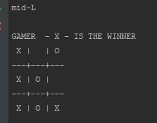

# Tic-Tac-Toe Game
> This is simple game Tic-Tac-Toe !

## Table of contents
* [General info](#general-info)
* [Screenshots](#screenshots)
* [Technologies](#technologies)
* [Setup](#setup)
* [Features](#features)
* [Status](#status)
* [Inspiration](#inspiration)
* [Contact](#contact)

## General info
This game it's funny stuff. From hard work it'll be good.

## Screenshots

## Technologies
* Python - v.3.6

## Setup
* Install Python interpreter
* Download tictactoe.py
* Enter `python3 tictactoe.py`

## HUI - How Use It
Command:

* we use strings from slot to put X or O in it.
* 'clear' - it's clear all slot 
* 'exit' - exit from game

## Status
Project is: _in progress_.

## Inspiration
Project inspired by Automated bornign Stuff....

## Contact
Created by [@sebadamek](sebadamek@wp.pl) - feel free to contact me!
